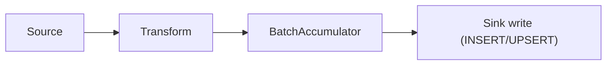
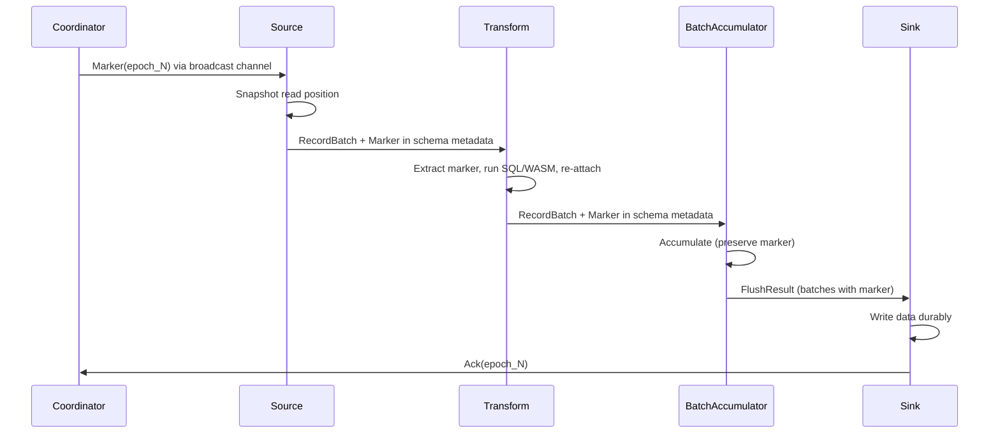
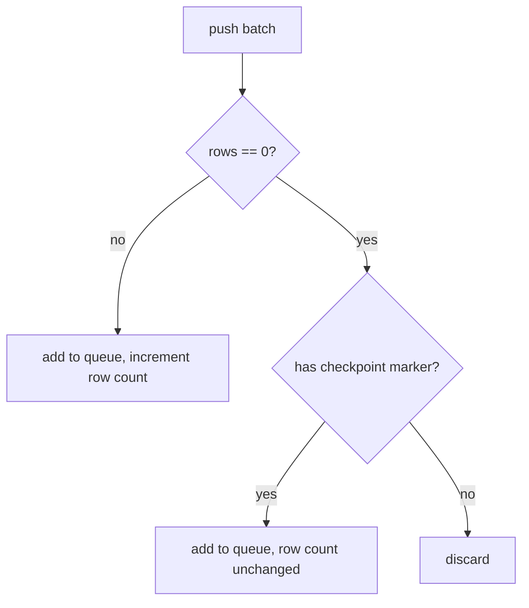
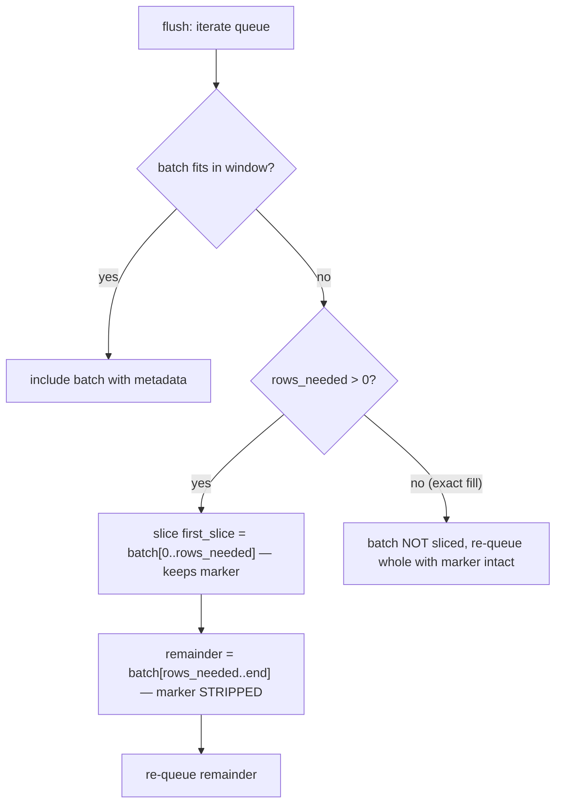
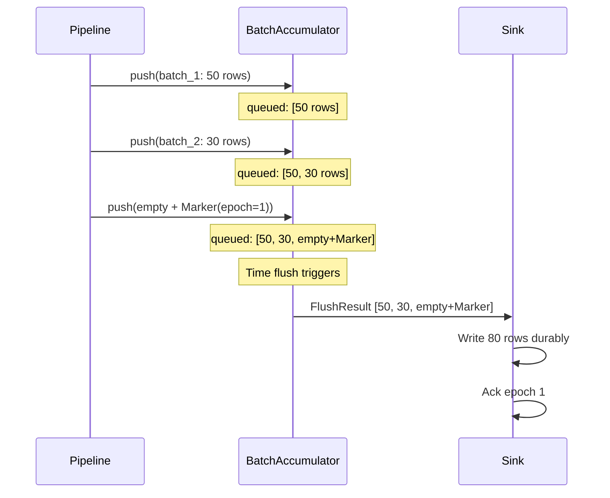
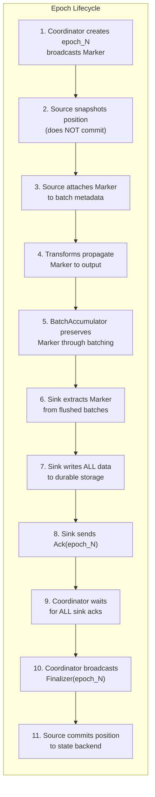

# BatchAccumulator and the Checkpoint Protocol

> **Formal spec:** [`batch-accumulator.allium`](./batch-accumulator.allium) — the authoritative behavioural specification for the BatchAccumulator's checkpoint-aware batching. This document is a narrative companion; where they diverge, the Allium spec is canonical.

## What BatchAccumulator Does

`BatchAccumulator` is a buffering component used by sinks (Postgres, ClickHouse) to collect incoming Arrow `RecordBatch`es and flush them in size- or time-based windows. It sits between the transform layer and the sink's write path:



Without checkpointing, this is straightforward batching. With checkpointing, the accumulator becomes a critical participant in the at-least-once delivery guarantee because **checkpoint markers travel as metadata on the very batches being accumulated**.

---

## How Checkpoint Markers Travel

Checkpoint markers don't use a separate control channel between source and sink. Instead, they piggyback on `RecordBatch` schema metadata:

```
RecordBatch {
    schema.metadata: {
        "checkpoint_messages": "[{\"Marker\":{\"epoch\":{\"0\":42},\"created_at_ms\":1709000000}}]"
    },
    columns: [actual data...]
}
```



---

## The Problem BatchAccumulator Must Solve

Because markers ride on batch metadata, the accumulator must handle three scenarios correctly:

### 1. Empty batches carrying markers

A SQL `WHERE` clause might filter all rows to zero, but the empty batch still carries a checkpoint marker. If the accumulator discards empty batches (as a naive implementation would), the marker is lost, the sink never acks, and checkpointing stalls forever.

**Solution:** `push()` checks for checkpoint metadata on empty batches. Empty batches with markers are preserved in the accumulation queue; empty batches without markers are discarded.



### 2. Batch splitting must not duplicate markers

When accumulated rows exceed `batch_size`, the accumulator splits a batch: the first N rows go to the current flush, the remainder stays in the queue. Arrow's `slice()` operation shares the underlying schema (including metadata), so both halves would carry the same checkpoint marker. If both halves eventually reach the sink's ack logic, the same epoch gets acked twice.

**Solution:** When splitting, the first slice keeps the checkpoint metadata. The remainder is explicitly stripped via `strip_checkpoint_messages()`. When prior batches exactly filled the window (`rows_needed = 0`), the batch is not sliced at all — it is re-queued whole with its marker intact.



### 3. Markers must not be acked before prior data is written

A checkpoint marker on batch N means "all data up to this point has been delivered." If the accumulator returns a marker-bearing batch immediately (before prior accumulated data is flushed), the sink might ack epoch N before writing data from batches 1..N-1.

**Solution:** Empty checkpoint batches are **queued** (added to `accumulated_batches`), not returned immediately. They flush together with any preceding data batches. The sink only sees the marker after all prior data has been included in a flush.



---

## The At-Least-Once Guarantee Chain

The full guarantee depends on every component in the chain behaving correctly:



**If any step 5-11 fails:** the epoch times out, no Finalizer is sent, sources never commit, and all data from the failed epoch is reprocessed on restart.

**BatchAccumulator's role (step 5)** is to ensure markers survive the batching layer intact:
- Not lost (empty batch preservation)
- Not duplicated (strip on split)
- Not premature (queue, don't return immediately)

---

## Flush Triggers

The accumulator flushes on two conditions:

| Trigger | Condition | Purpose |
|---------|-----------|---------|
| **Size** | `current_row_count >= batch_size` | Efficient bulk writes |
| **Time** | `elapsed >= batch_flush_interval` | Bounded latency for low-throughput streams |

`AsyncBatchAccumulator` wraps the synchronous accumulator with a `tokio::select!` loop that races incoming batches against a timer tick. On stream completion, it calls `flush_all()` to drain any remaining batches (including trailing checkpoint markers).

---

## Edge Cases

### Large batch exceeding batch_size

A single 500-row batch with `batch_size=100` produces 5 flush cycles. The checkpoint marker appears on exactly the first flush; the remaining 4 are stripped.

### Exact fill

If prior batches exactly fill `batch_size` (e.g., 40 + 60 = 100), the next batch with a checkpoint marker starts a fresh accumulation window. The marker is preserved on that batch and flushed in the next cycle.

### Multiple markers from different epochs

Each marker is attached to its own batch. The accumulator preserves ordering. When flushed together, the sink processes each marker independently, sending separate acks for each epoch.

### Idle stream

When no data arrives but the stream is still open, the timer tick fires `flush()` which returns empty. The `AsyncBatchAccumulator` calls the output function with an empty batch list, allowing sinks to perform heartbeat-like operations (e.g., ack checkpoint markers that arrived on earlier empty batches).
