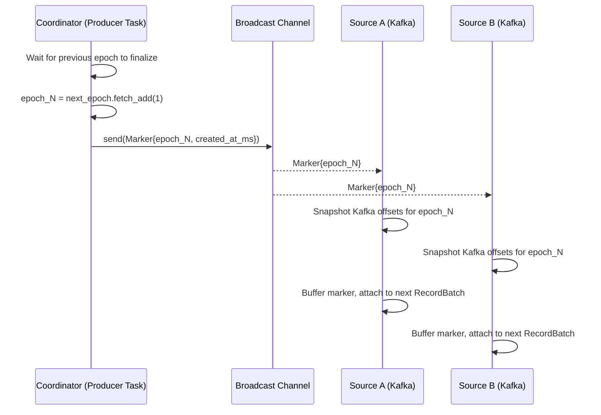
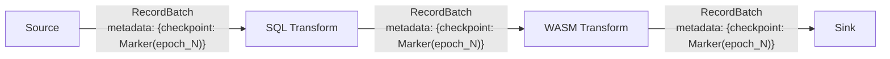
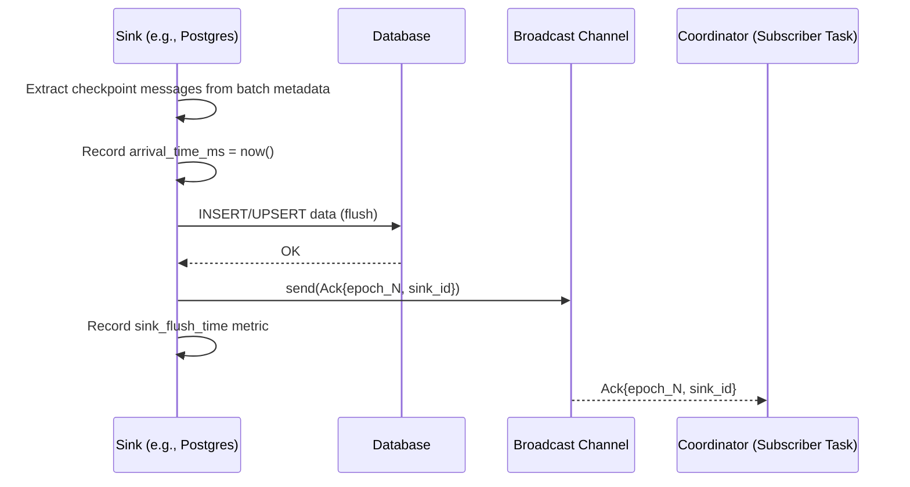
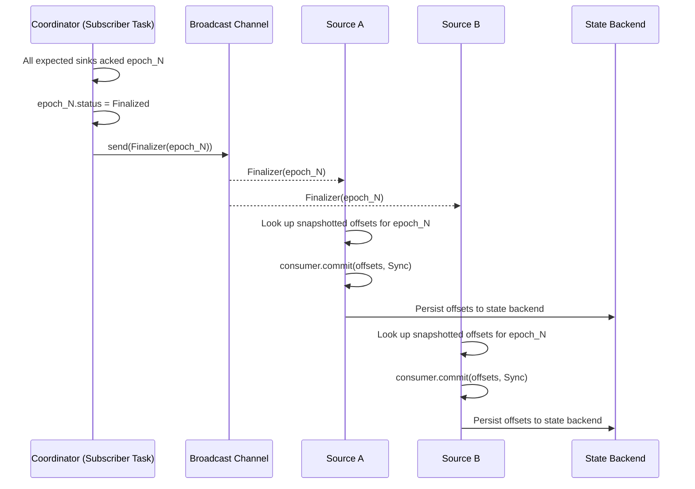
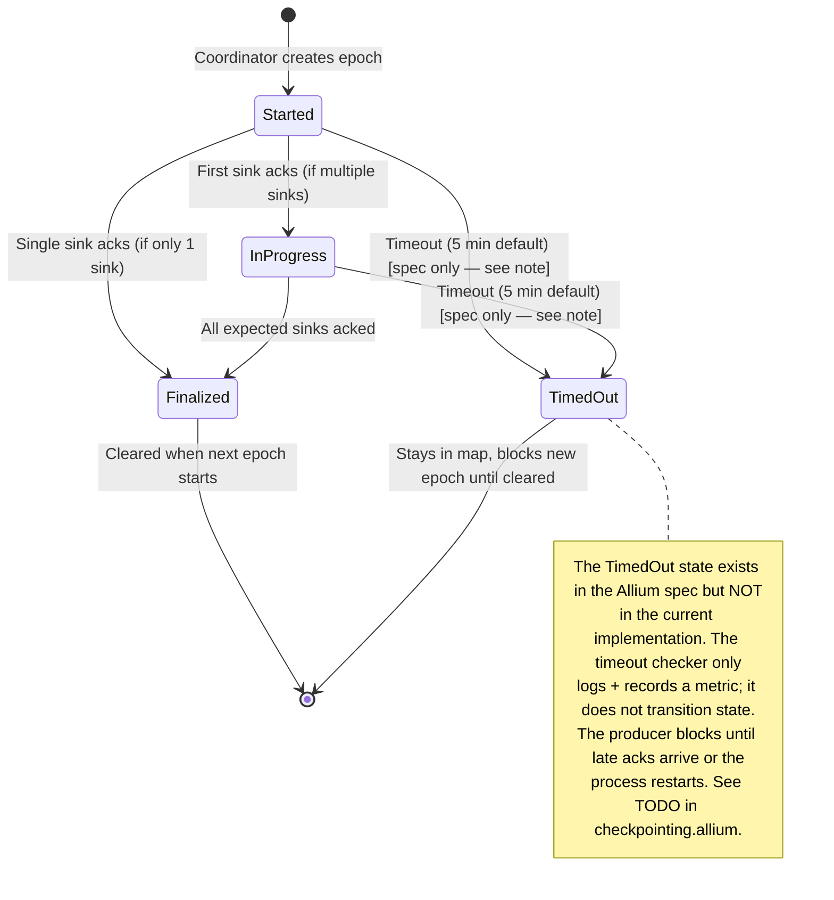
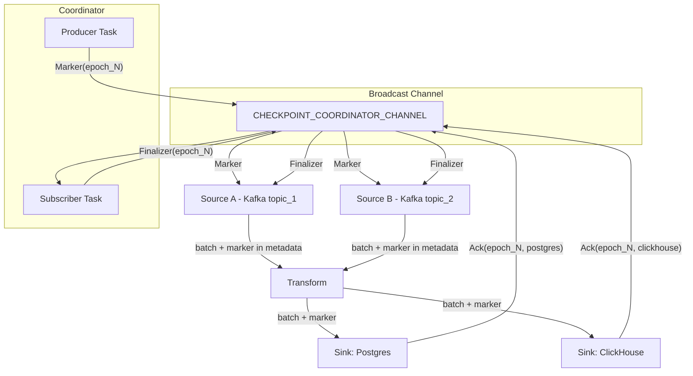
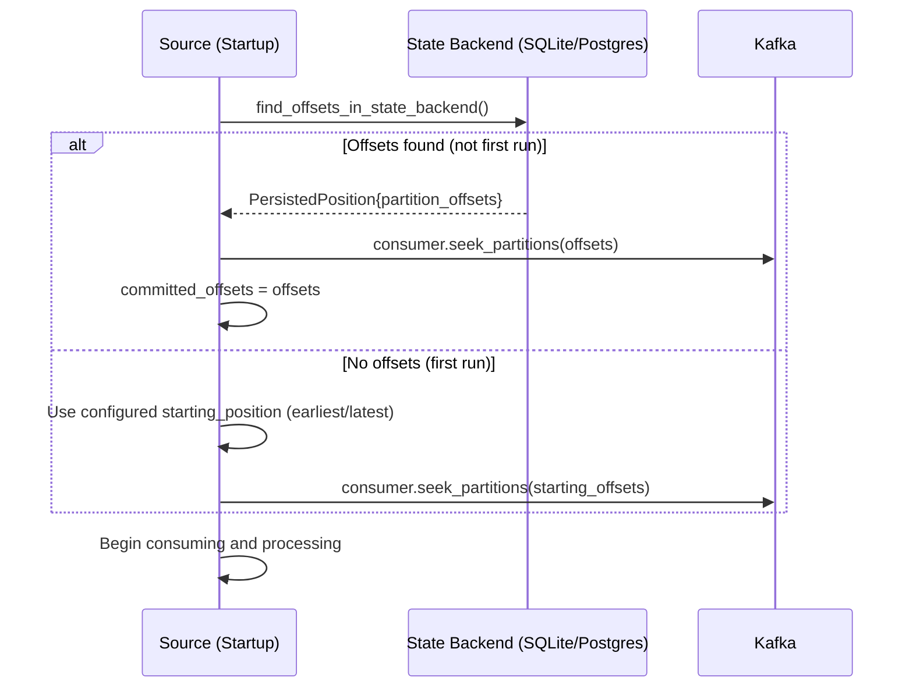

# Streamling Checkpoint Protocol — Deep Dive

> **Formal spec:** [`checkpointing.allium`](./checkpointing.allium) — the authoritative behavioural specification for the checkpoint protocol. This document is a narrative companion; where they diverge, the Allium spec is canonical.

## Executive Summary

Streamling uses a **Coordinator-driven, barrier-based checkpoint protocol** to achieve **at-least-once delivery**. The protocol is:

- **Sequential**: only one epoch in-flight at a time
- **Barrier-based**: checkpoint markers flow through the data stream as metadata on `RecordBatch` schemas
- **Coordinator-centric**: a single `CheckpointCoordinator` orchestrates the Marker → Ack → Finalizer lifecycle

---

## Core Mental Model

```
Coordinator owns the epoch lifecycle.
Sources snapshot positions when they see a Marker.
Transforms are transparent — they just forward markers.
Sinks flush data, then ack.
Coordinator collects all acks, then broadcasts Finalizer.
Sources commit positions on Finalizer.
```

The invariant: **sources never commit positions until ALL sinks have durably written all data up to that point.**

---

## Protocol Phases

### Phase 1: Marker Broadcast



**Key details:**
- Markers travel via a global `crossbeam` broadcast channel (`CHECKPOINT_COORDINATOR_CHANNEL`)
- Each source subscribes to this channel on startup
- Sources buffer the marker and embed it in the next `RecordBatch`'s schema metadata as JSON
- Sources also snapshot their current read position (e.g., Kafka partition offsets) for later commit

### Phase 2: Marker Propagation Through Transforms



**Transforms are transparent.** The `CheckpointableExec` operator:
1. Extracts checkpoint messages from input batch metadata
2. Passes data through the SQL/transform plan
3. Re-attaches checkpoint messages to the output batch metadata

Even if a SQL `WHERE` clause filters all rows to zero, the empty batch **still carries the checkpoint marker** (via `StreamingFilterExec`). This is critical — otherwise sinks would never see the marker and epochs would stall.

### Phase 3: Sink Flush + Ack



**Critical contract:** Sinks MUST flush all data to durable storage BEFORE sending the ack. Violating this breaks the at-least-once guarantee — the coordinator would finalize the epoch, sources would advance past data that was never persisted.

### Phase 4: Finalization + Source Commit



**Only after finalization** do sources commit their read positions. This is the "point of no return" — committed positions determine where sources resume after restart.

---

## Full Lifecycle Diagram



---

## Multiple Sources



**Multiple sources each independently:**
1. Subscribe to the same broadcast channel
2. Receive the same Marker
3. Snapshot their own positions (Kafka offsets are per-source)
4. Embed the marker in their own output batches
5. Receive the same Finalizer
6. Commit their own positions independently

Sources don't coordinate with each other. The coordinator doesn't distinguish between sources — it only tracks sink acks.

---

## Multiple Sinks

The coordinator is initialized with `expected_sinks: Vec<String>` — the list of all sink reference names. An epoch is finalized when **every** expected sink has acked.

```
Epoch State Machine (2 sinks: "postgres", "clickhouse"):

Started
  ├── Ack("postgres") → InProgress { acked: {"postgres"} }
  │                        └── Ack("clickhouse") → Finalized ✓
  └── Ack("clickhouse") → InProgress { acked: {"clickhouse"} }
                             └── Ack("postgres") → Finalized ✓
```

**Ack ordering doesn't matter.** The coordinator uses a `HashSet<String>` and checks `expected_sinks.iter().all(|s| acked_sinks.contains(s))`.

**Unexpected sinks are rejected:** If an ack arrives from a sink not in `expected_sinks`, it's logged as a warning and ignored. This prevents phantom sinks from prematurely finalizing epochs.

---

## Back Pressure and Timeout

### Back Pressure: Sequential Epochs

The producer task **blocks** before creating a new epoch:

```
loop {
    sleep(checkpoint_interval);              // e.g., 5 seconds
    wait_for_previous_epoch_to_finalize();   // ← BLOCKING
    create_new_epoch();
    send_marker();
}
```

If any sink is slow, the previous epoch stays `Started` or `InProgress`, and **no new markers are sent**. This creates back pressure:
- A slow sink stalls ALL future checkpoints
- Data continues flowing (checkpointing is non-blocking for data)
- But no new positions get committed

Every 10 seconds while waiting, the coordinator logs which sinks haven't acked yet:
```
WARN: Checkpoint producer still waiting for finalization (45s elapsed): epoch=7, state=InProgress — missing sinks: ["clickhouse"]
```

### Timeout

A background task checks every 30 seconds for stalled epochs:

```
if epoch.created_at + timeout_duration < now:
    warn!("Checkpoint epoch {} timed out", epoch)
    record_metric("checkpoint_epochs_failed")
    // NOTE: epoch state is NOT changed — it stays Started/InProgress
```

- Default timeout: **5 minutes** (`DEFAULT_CHECKPOINT_TIMEOUT_SEC = 300`)
- The timeout checker **only logs and records a metric** — it does not transition epoch state
- There is no `TimedOut` variant in `EpochState`; the epoch stays `Started` or `InProgress`
- The producer checks `matches!(state, EpochState::Finalized)` — a timed-out epoch is NOT finalized
- **The producer blocks indefinitely** until either late acks arrive or the process restarts
- **No Finalizer is sent** for stuck epochs — sources don't commit (at-least-once holds)

**Implication:** The timeout is currently observability-only. It alerts operators that something is stuck, but does not unblock the checkpoint pipeline. Recovery requires either the slow sink eventually catching up, or a process restart. The Allium spec (`checkpointing.allium`) models a `timed_out` state transition that would unblock the producer — see the TODO there for the planned resolution.

---

## Failure Modes

### 1. Sink Crashes Before Ack

```
Source → Transform → Sink (CRASH before ack)
```

- The epoch never gets all acks → stays pending → times out
- No Finalizer sent → sources don't commit positions
- On restart, sources resume from last committed position
- Data from the failed epoch is **reprocessed** (at-least-once)

### 2. Source Crashes After Marker, Before Finalizer

```
Source (receives Marker, snapshots offsets, CRASH)
```

- Source never committed offsets (Finalizer never arrived or source crashed)
- On restart, source recovers from state backend's last persisted position
- State backend has positions from the LAST SUCCESSFULLY FINALIZED epoch
- Data since that epoch is reprocessed

### 3. Duplicate Acks

A sink might send duplicate acks (e.g., batch accumulator splits a batch). Protections:
- `strip_checkpoint_messages()` removes markers from remainder slices after batch splitting
- Coordinator logs a warning for acks to already-finalized epochs but doesn't crash
- Acks from unknown epochs (not in the `epochs` map) are warned and ignored

### 4. Unexpected Sink Acks

If a sink not in `expected_sinks` sends an ack:
- Coordinator logs a warning and `continue`s (ignores the ack)
- The epoch is NOT prematurely finalized

### 5. Empty Batches Carrying Markers

If a SQL filter produces 0 rows but the input had a checkpoint marker:
- `StreamingFilterExec` preserves metadata on the empty batch
- Sink receives the empty batch, extracts the marker, sends ack
- The checkpoint protocol is NOT broken by zero-row batches

### 6. Network Partition / Kafka Rebalance

- Kafka consumer rebalance may invalidate snapshotted offsets
- The Kafka source filters out invalid offsets before committing:
  - Newly assigned partitions (no messages consumed yet)
  - Partitions with no new messages post-seek
- If commit fails, the error is logged but not fatal — the rebalance will re-assign partitions

---

## At-Least-Once Guarantee — How It Works

The guarantee chain:

```
1. Sources READ data and advance their read cursor
2. Sources SNAPSHOT their position when Marker arrives (but don't commit)
3. Data flows through transforms (markers piggybacked on batches)
4. Sinks FLUSH data to durable storage
5. Sinks ACK the epoch
6. Coordinator waits for ALL sink acks
7. Coordinator sends Finalizer
8. Sources COMMIT their snapshotted position to state backend
```

**If any step 4-8 fails:**
- Sources don't commit → on restart, they resume from last committed position
- All data from the failed epoch is re-read and re-processed
- Sinks must be **idempotent** (upsert semantics via `_gs_op` column) to handle duplicates

**Why "at-least-once" and not "exactly-once":**
- A sink may have flushed data but crashed before sending ack
- The epoch times out, sources don't commit, data is reprocessed
- The sink now has the data twice → "at least once"
- Exactly-once would require two-phase commit across all sinks

---

## Recovery Flow



**State backend takes precedence** over Kafka consumer group offsets. This ensures the checkpoint protocol's positions are authoritative.

---

## Data Flow: Checkpoint Messages as Batch Metadata

Checkpoint markers don't travel in a separate channel from source to sink. Instead, they **piggyback on the Arrow RecordBatch schema metadata**:

```
RecordBatch {
    schema: Schema {
        fields: [id: Int32, name: Utf8, ...],
        metadata: {
            "checkpoint_messages": "[{\"Marker\":{\"epoch\":{\"0\":42},\"created_at_ms\":1709000000000}}]"
        }
    },
    columns: [...]
}
```

This is serialized as JSON in the `checkpoint_messages` metadata key. The flow:

```
Source                          Transform                       Sink
  │                                │                              │
  ├─ receive Marker via channel    │                              │
  ├─ buffer it                     │                              │
  ├─ on next poll, build batch     │                              │
  ├─ enrich_batch_metadata()  ────>│                              │
  │                                ├─ extract from input batch    │
  │                                ├─ run SQL/transform           │
  │                                ├─ re-attach to output batch ─>│
  │                                │                              ├─ extract_checkpoint_messages()
  │                                │                              ├─ flush data to storage
  │                                │                              ├─ send Ack via channel
```

### Batch Accumulator and Deduplication

Sinks often accumulate batches before flushing (for efficiency). The `BatchAccumulator`:
- Preserves empty batches if they carry checkpoint metadata
- When splitting an oversized batch: the **first slice keeps** the checkpoint metadata, the **remainder is stripped**
- This prevents duplicate acks from a single marker

---

## Metrics

| Metric | Type | Description |
|--------|------|-------------|
| `checkpoint_markers_sent` | Counter | Markers broadcast by coordinator |
| `checkpoint_acks_received` | Counter | Acks received by coordinator |
| `checkpoint_epochs_succeeded` | Counter | Epochs successfully finalized |
| `checkpoint_epochs_failed` | Counter | Epochs that timed out |
| `checkpoint_finalizers_sent` | Counter | Finalizer messages broadcast |
| `checkpoint_epochs_in_flight` | Gauge | Non-finalized epochs (should be 0 or 1) |
| `checkpoint_epoch_duration` | Timer | Time between consecutive finalizations |
| `checkpoint_finalization_wait` | Timer | How long producer waited for previous epoch |
| `checkpoint_marker_arrival` | Timer | Marker creation → sink arrival latency |
| `checkpoint_sink_flush` | Timer | Time sink spent flushing before ack |
| `checkpoint_per_sink_ack_latency` | Timer | Per-sink time from epoch creation to ack (tagged by sink_id) |
